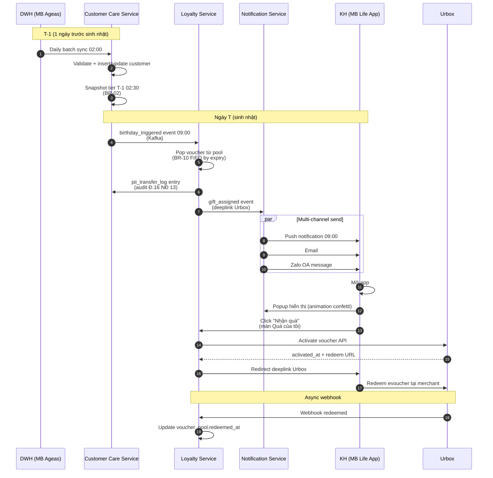
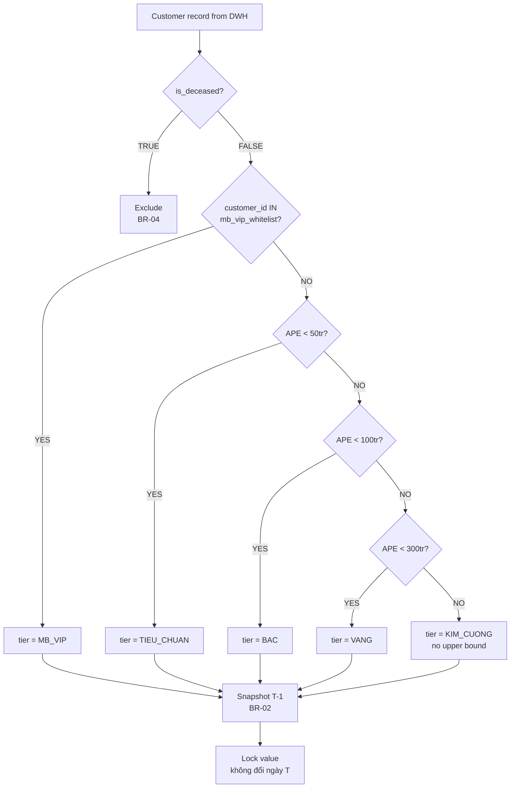
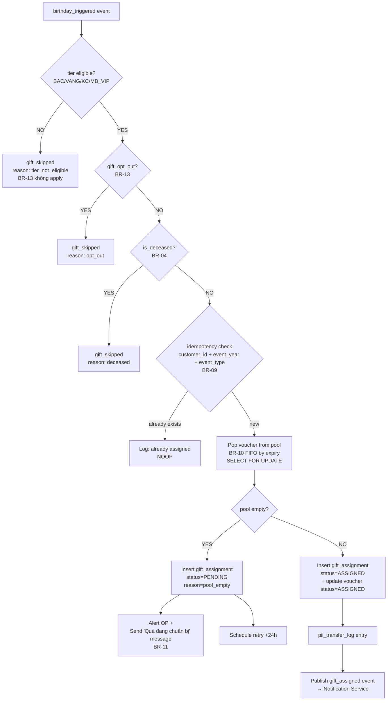
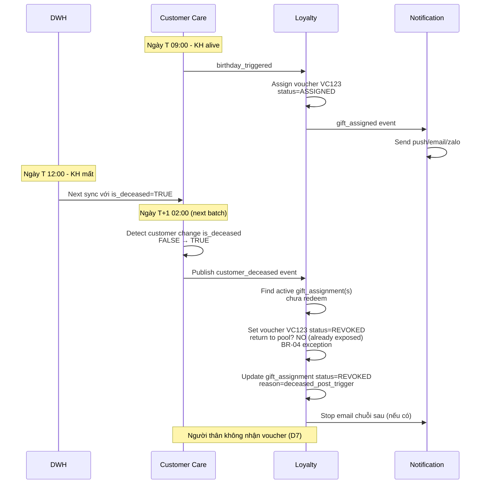
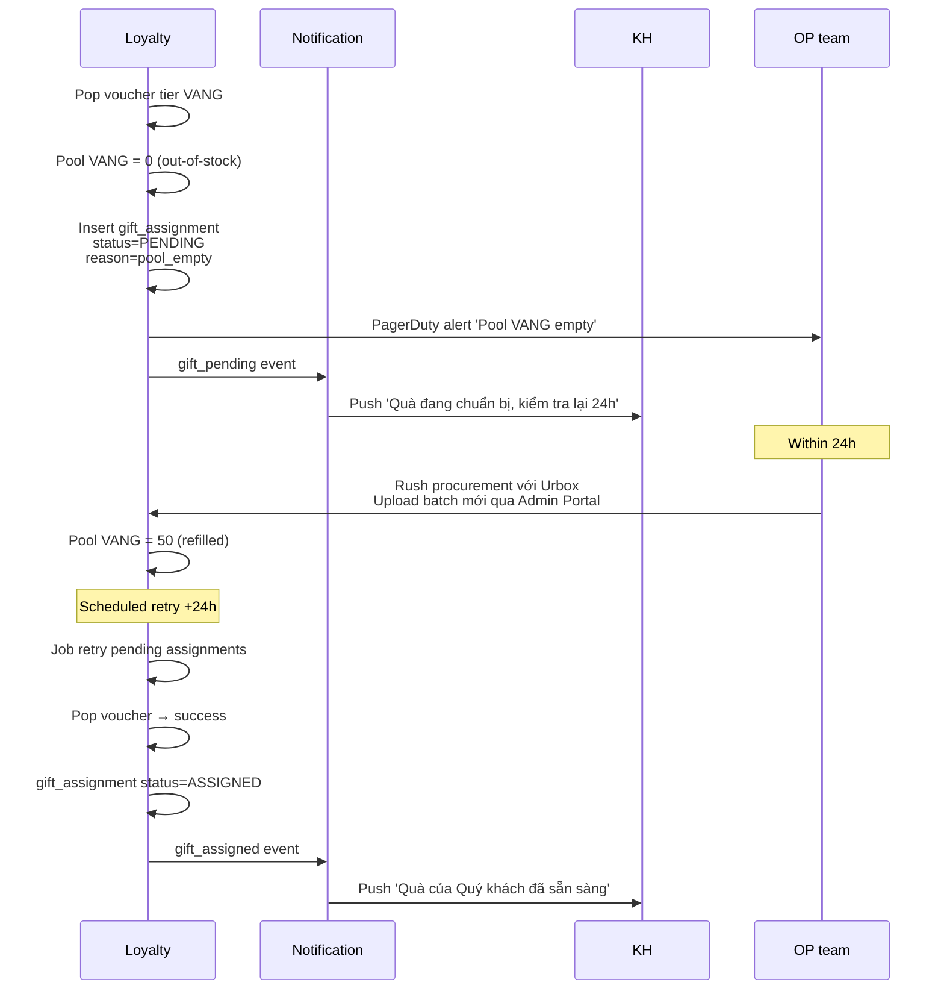
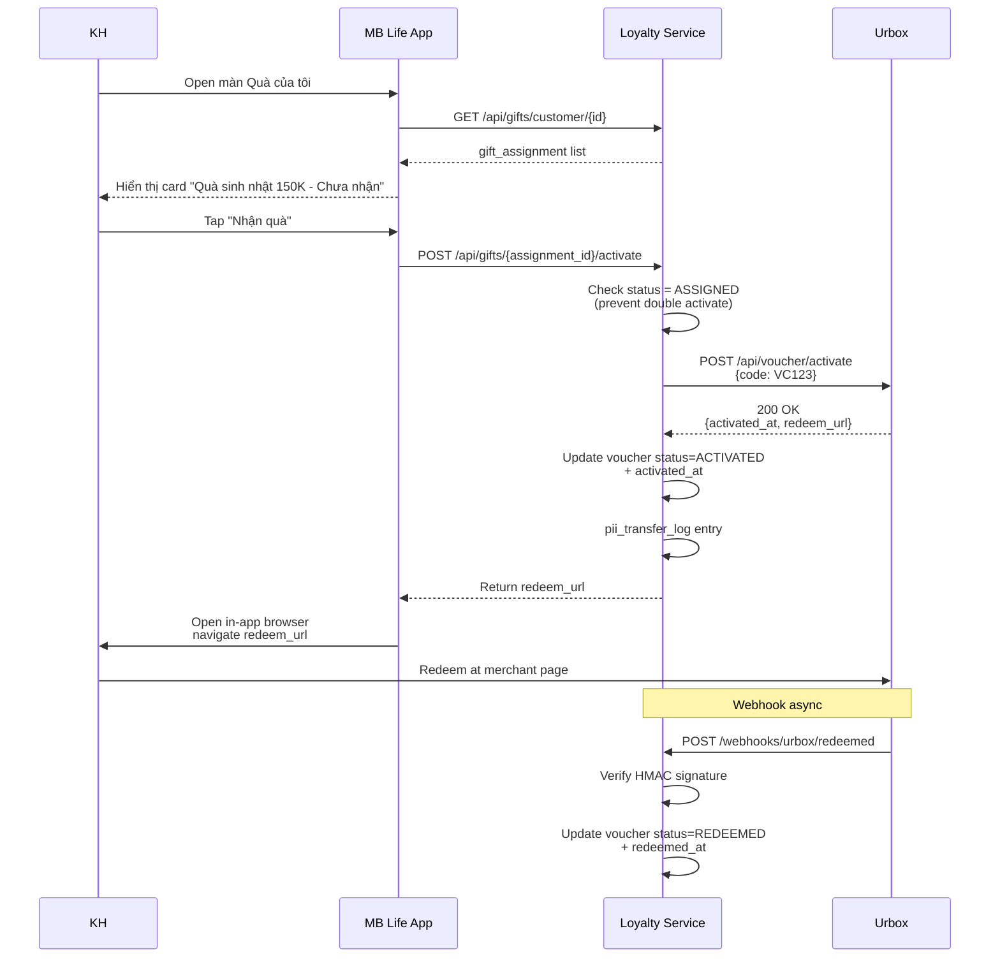
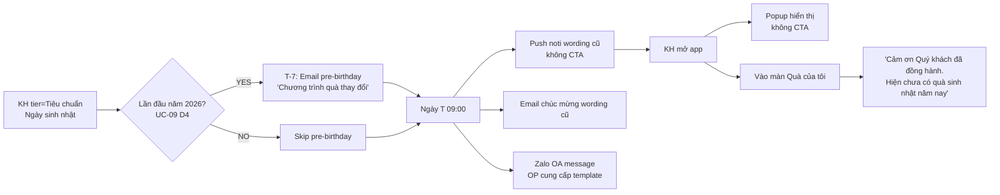
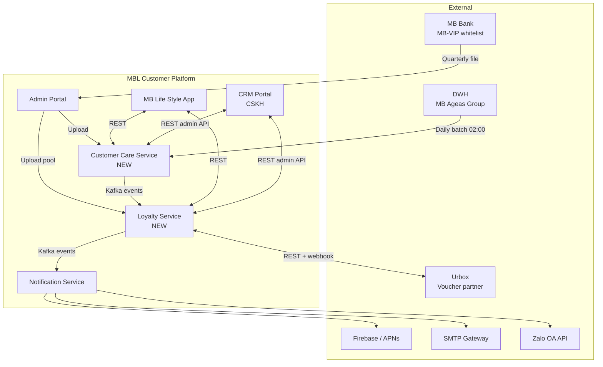

# Process Flow Diagrams — Quà sinh nhật

**Doc**: BA-DEL-05
**Author**: Trang (BA Lead)
**Date**: 2026-05-04
**Version**: 1.0
**Audience**: Toàn team (Devs, QA, Designer, PO, PM)

**Format**: Mermaid diagrams (render trên GitHub, GitLab, Confluence Mermaid plugin, hoặc paste vào https://mermaid.live)

---

## Diagram 1 — End-to-end happy path (KH tier Bạc)



---

## Diagram 2 — Tier classification logic



---

## Diagram 3 — Voucher assignment (with fallback)



---

## Diagram 4 — KH chết post-trigger rollback



---

## Diagram 5 — Out-of-stock fallback flow



---

## Diagram 6 — Voucher redemption (KH click Nhận quà)



---

## Diagram 7 — KH journey (Tiêu chuẩn — không nhận quà)



---

## Diagram 8 — System Context (high-level)



---

## Diagram 9 — Data lineage

```mermaid
flowchart LR
    subgraph DWH
        D1[customer_master]
        D2[policy_master]
        D3[deceased_register]
    end

    subgraph CC[(customer_care_database)]
        T1[customer]
        T2[customer_tier_snapshot]
        T3[mb_vip_whitelist]
        T4[pii_transfer_log]
        T5[customer_consent]
    end

    subgraph L[(loyalty_database)]
        V1[voucher_pool]
        V2[gift_assignment]
        V3[voucher_pool_audit]
    end

    D1 -->|customer_id, name, phone, email, DOB| T1
    D2 -->|aggregate APE| T1
    D3 -->|is_deceased flag| T1

    T1 -->|compute tier| T2
    T3 -->|override| T2

    T2 -->|trigger| V2
    V1 -->|pop FIFO| V2
    V2 -->|sensitive transfer| T4
    T5 -->|consent check| T4
```

---

## How to render

- **GitHub/GitLab/Confluence Mermaid plugin**: paste blocks above directly.
- **Online**: https://mermaid.live → paste 1 block → export PNG/SVG.
- **VSCode**: install "Markdown Preview Mermaid Support" extension.

## Notes for Designer (Duy)

Diagram 1 + 6 đặc biệt quan trọng cho UX:
- **Diagram 1 step 13**: Popup hiển thị animation confetti — em note phối hợp với Marketing về confetti asset.
- **Diagram 6 step 8-10**: KH click Nhận quà → tương tác giữa app + Urbox redirect — UX cần loading state mượt + handle case Urbox 5xx.
